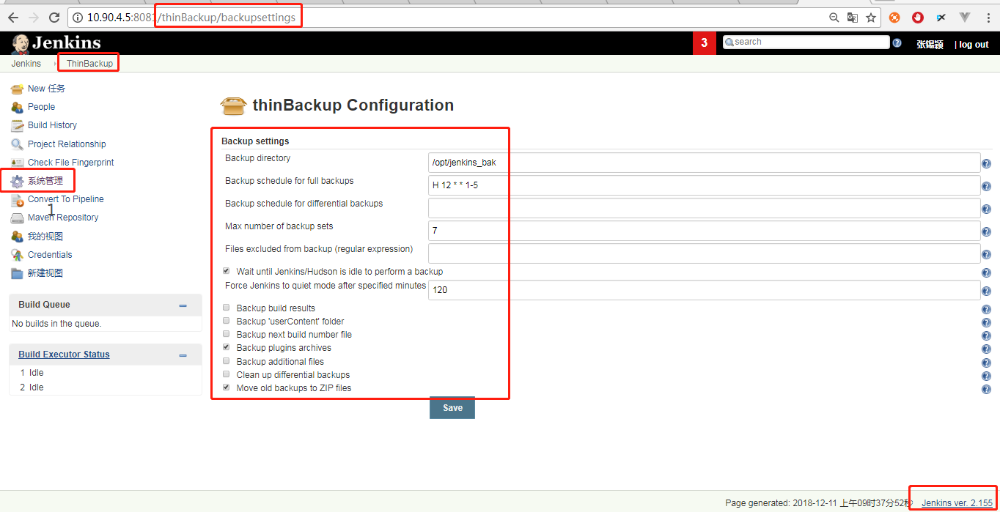

# Jenkins-Pipeline的使用

#### 注意：

```
维护jenkins的话，建议都装一个插件：ThinBackup
安装或者重启jenkins前都备份一下插件，我今天安装完插件，照常重启了jenkins后，git插件以及其他的一些就不能用了，我们jenkins的版本（2.121）不高不低处在中间，现在jenkins建议安装到2.155，我在测试环境2.107上随便搞都没问题，生产环境一下子就把jenkins都搞的不能打包了。没办法备份了当前的状态之后只能升级jenkins了，很幸运，升级到2.155之后，jenkins又能用了。真惊险
```

 


目前运维项目中jenkins配置一般顺序是：拉代码（svn/gitlab）--构建（maven build/npm build）--远程ssh到服务器（停服务-备份代码包）--替换代码包--远程ssh到服务器（启服务），pipeline脚本可以在同一个脚本中实现以上所有内容。

Jenkins 2.x的精髓是Pipeline as Code，那为什么要用Pipeline呢？jenkins1.0也能实现自动化构建，但Pipeline能够将以前project中的配置信息以steps的方式放在一个脚本里，将原本独立运行于单个或者多个节点的任务连接起来，实现单个任务难以完成的复杂流程，形成流水式发布，构建步骤视图化。简单来说，Pipeline适用的场景更广泛，能胜任更复杂的发布流程。

## 一、安装插件

```
Build Pipeline Plugin
Convert To Pipeline
Pipeline GitHub Notify Step Plugin
Pipeline Graph Analysis Plugin
Pipeline Maven Integration
Pipeline NPM Integration Plugin
Pipeline: API
Pipeline: Basic Steps
Pipeline: Build Step
Pipeline: Input Step
Pipeline: Job
Pipeline: Stage Tags Metadata
Pipeline: Stage View Plugin
Pipeline: Declarative
```

以上为必备常用插件，若想支持更多功能详见附件Jenkins-Pipeline插件的安装

## 二、代码转换器/生成器的使用

```
点击view_name：hhbank_dev
点击job_name：harbin_dev_products
点击左侧：Convert This Job To Pipeline 

未填写任何信息，变更如下，编辑视图名hhbank_dev，把新job勾选进本视图内
view_name：all
job_name：harbin_dev_products-pipeline
```

代码生成器可以自动生成一些语法：

http://jenkinsIP:8080/view/hhbank_dev/job/111/directive-generator/

## 三、新建一个Pipeline类型的job

```
job_name：自定义
类型：选择流水线/工作流pipeline
```

## 四、脚本编写

Pipeline支持两种语法：**Declarative Pipeline**（在Pipeline 2.5中引入，结构化方式）和**Scripted Pipeline**，大部分使用第一种声明式。

**共同点：**
两者都是pipeline代码的持久实现，都能够使用pipeline内置的插件或者插件提供的steps，两者都可以利用共享库扩展。
**区别：**
两者不同之处在于语法和灵活性。Declarative pipeline对用户来说，语法更严格，有固定的组织结构，更容易生成代码段，使其成为用户更理想的选择。但是Scripted pipeline更加灵活，因为Groovy本身只能对结构和语法进行限制，对于更复杂的pipeline来说，用户可以根据自己的业务进行灵活的实现和扩展。下面举例介绍两种语法的使用。

**特点：**

```
1、Pipeline模式把自由风格模式项目中除了构建触发器外的所有模块都编码到Jenkinsfile文件中，发布配置和代码绑定在一起在SCM进行审查维护，大大增加其可移植性.
2、Pipeline项目执行后可在项目首页形象地看到每个stage执行状态及运行时间.
3、Pipeline日志系统简洁，当某次任务失败，需要找到其失败位置，在自由风格项目中需要点击到该任务的控制台输出，在任务执行的所有日志中查找.而Pipeline项目可直接在项目首页点击任务失败的stage看到原因.
4、Pipeline通过input命令可实现人工介入该过程，更加可靠地判断是否需进行如发布到生产环境的后续步骤.
5、Pipeline通过parallel命令可便捷实现并行任务，加快交付验证的速度.Pipeline通过input命令可实现人工介入该过程，更加可靠地判断是否需进行如发布到生产环境的后续步骤.
```

script语法：

```
node {  
    stage('Build') { 
        // 
    }
    stage('Test') { 
        // 
    }
    stage('Deploy') { 
        // 
    }
}
```

我们的重点不是script语法的脚本，而是Declarative语法，原因是script太灵活了，反而不容易维护的编写，相比起来Declarative有比较严格的语法要求，易读且易维护。

以哈行SIT环境product和前端h5为例：

```
pipeline {
    options {
        timestamps () 
        buildDiscarder logRotator(artifactDaysToKeepStr: '3', artifactNumToKeepStr: '1', daysToKeepStr: '3', numToKeepStr: '10')
    }
    agent any
    parameters {
        string(name:'server1IP', defaultValue: 'server1IP', description: '部署代码所在server1_ip地址')
        string(name:'server2IP', defaultValue: 'server2IP', description: '部署代码所在server2_ip地址')
        string(name:'pomPath', defaultValue: 'plusplatform-fronts/plusplatform-front-products/plusplatform-product-harb/pom.xml', description: 'maven构建pom.xml')
        string(name:'jarPack', defaultValue: 'plusplatform-fronts/plusplatform-front-products/plusplatform-product-harb/target/plusplatform-product-harb-1.0.0-SNAPSHOT.jar', description: 'maven构建出的jar包')
        string(name: 'proPath',defaultValue:'/opt/plusplatform', description: '服务路径')
        string(name: 'bakPath',defaultValue:'/opt/plusplatform/jar_bak', description: '备份路径')
    }
    stages {
        stage ('拉取gitlab代码') {
            steps {
                git branch: 'master', credentialsId: '75a79a50-ea18-4fb9-9179-6d800118c85a', url: 'git@gitlabIP:plusplatform/plusplatform.git'
            }
        }

        stage ('maven构建') {
            steps {
                // withMaven(jdk: 'jdk1.8', maven: 'maven3', mavenSettingsFilePath: '/opt/apache-maven-3.5.3/conf/settings.xml', mavenLocalRepo: '.repository') {
                withMaven(jdk: 'jdk1.8', maven: 'maven3', mavenSettingsFilePath: '/var/lib/jenkins/settings.xml', mavenLocalRepo: '/var/lib/jenkins/.m2/repository') {
                    // sh "mvn -f ${params.pomPath} -Dmaven.repo.local -Dmaven.test.skip=true clean install"
                    sh "mvn -f ${params.pomPath} -Dmaven.test.skip=true clean install"
                    // sh "mvn -Dmaven.test.skip=true clean install"
                }
            }
        }

        stage ('获取包名') {
            steps {
                script {
                    def split=params.jarPack.split("/")
                    jarPackname=split[-1]
                }
            }
        }

        // stage ('输出包名') {
        //     steps {
        //         sh "echo ${jarPackname}"
        //     }
        // }
        
        stage ('备份生产包') {
            steps {
                // sh "ssh -f -n root@${params.server1IP} mkdir ${params.bakPath}"
                sh "ssh -f -n root@${params.server1IP} mv ${params.proPath}/${jarPackname} ${params.bakPath}/`date +%Y%m%d-%H%M%S`+${jarPackname}"
                // sh "ssh -f -n root@${params.server2IP} mkdir ${params.bakPath}"
                sh "ssh -f -n root@${params.server2IP} mv ${params.proPath}/${jarPackname} ${params.bakPath}/`date +%Y%m%d-%H%M%S`+${jarPackname}"
                }
        }

        stage ('推送生产包') {
            steps {
                sh "scp ${params.jarPack} root@${params.server1IP}:${params.proPath}"
                // sh "scp /var/lib/ms root@${params.server1IP}:${params.proPath}"
                sh "scp ${params.jarPack} root@${params.server2IP}:${params.proPath}"
                // sh "scp /var/lib/ms root@${params.server2IP}:${params.proPath}"
                }
        }

        stage ('重启服务') {
            steps {
                // sh "ssh -f -n root@${params.server1IP} chmod +x ${params.proPath}/ms"
                sh "ssh -f -n root@${params.server1IP} ${params.proPath}/ms ${params.proPath}/${jarPackname} pro"
                // sh "ssh -f -n root@${params.server2IP} chmod +x ${params.proPath}/ms"
                sh "ssh -f -n root@${params.server2IP} ${params.proPath}/ms ${params.proPath}/${jarPackname} pro"
            }
        }
    }
}
```

前端h5：

```
pipeline {
    agent any
    parameters {
        string(name:'serverIP', defaultValue: 'serverIP', description: '部署代码所在ip地址')
        string(name: 'proPath',defaultValue:'/data/harbin', description: '服务路径')
}
    stages {
        stage ('拉取gitlab代码') {
            steps {
                git branch: 'master', credentialsId: '06c8476d-ef81-4c84-b1eb-71d341abf97b', url: 'git@gitlabIP:BJ/haerbin-web.git'
            }
        }

        stage ('nodejs构建') {
            tools {
                nodejs 'NodeJS_V8.12'
            }

            steps {             
                sh "npm install && npm run build" 
                }
            }

        stage ('备份原代码'){
            agent {
               label 'serverIP'
            }

            steps{
                sh "cp -a ${params.proPath} /data/bak/`date +%Y%m%d`+harbin"
            }
        }

        stage ('推送测试包'){
            steps {
                sh "scp -r dist/* root@${params.serverIP}:${params.proPath}"
            }
        }
    }
}
```

## 五、优化发版速度

发版过程中，一开始使用远程ssh到其他服务器上进行操作，代码如下：

```
sh "ssh -f -n root@${params.serverIP} chmod +x ${params.proPath}/ms"
```

由于SIT线下环境网络连通速度慢的问题，导致每个远程连接5s，优化为：

```
agent {
               label 'serverIP'
            }

            steps{
                sh "chmod +x ${params.proPath}/ms"
            }
```

标签的操作方式详见参考文档：Jenkins高级篇之Pipeline-补充篇-如何添加一个windows节点的jenkins agent 服务，linux上加node节点同理。点击“系统管理”--“管理节点”，添加url：http://172.26.22.14:8080/computer/


第二个优化在于减少公共变量的使用，公共变量会在所有节点都进行声明一次，对于仅在一个stage中使用的变量或工具，仅在当前stage中声明即可

对于jdk和maven工具，仅在打包时使用，优化前：

```
    tools {
        maven 'maven3'
        jdk 'jdk1.8'
    }
    stage ('maven构建') {
            steps {
                sh "mvn -f ${params.pomPath} -Dmaven.test.skip=true clean install"
            }
        }
```

优化后：

```
 stage ('maven构建') {
            steps {
                withMaven(jdk: 'jdk1.8', maven: 'maven3') { 
                    sh "mvn -f ${params.pomPath} -Dmaven.test.skip=true clean install" 
                }
            }
        }
```


最大构建数：

```
    //丢弃旧的构建.构建天数：3,最大个数：10,发布包保留天数：3,发布包保留个数：1
    options {
        buildDiscarder logRotator(artifactDaysToKeepStr: '3', artifactNumToKeepStr: '1', daysToKeepStr: '3', numToKeepStr: '10')
    }
```

添加时间戳：

```
Declarative：Adding options to the pipleline
pipleline {
  agent any
  options { timestamps () }
  // stages and rest of pipleline.
}
```

## 六、实际操作

如需新建一个pipeline的job，先复制一个合适的pipeline脚本，我这边以交行sit北京方面的服务为例，

1、copy 交行项目pipeline/01信审系统/bj_jh-credit-server.groovy 成02用户管理/1bj_jh_idm-rest.groovy
2、修改1bj_jh_idm-rest.groovy，分别修改serverIP、WarPack、proPath、logPath、bakPath如实写成当前环境上的位置

```
    parameters {
        string(name:'serverIP', defaultValue: 'serverIP', description: '部署代码所在ip地址')
        string(name:'WarPack', defaultValue: 'smart-idm-rest/build/libs/smart-idm-rest-2.0.0-SNAPSHOT.jar', description: 'gradle构建出的服务jar包')
        string(name: 'proPath',defaultValue:'/opt/bj-jiaohang', description: '服务路径')
        string(name: 'logPath',defaultValue:'/opt/bj-jiaohang/logs', description: '日志路径')
        string(name: 'bakPath',defaultValue:'/opt/bj-jiaohang/bak', description: '备份路径')
```

3、修改拉取代码库的git url

```
stage ('拉取代码库') {
            steps {
                git branch: 'master', credentialsId: '06c8476d-ef81-4c84-b1eb-71d341abf97b', url: 'git@gitlabIP:smart/smart-idm/smart-ms-idm.git'
            }
        }
```

4、注意gradle构建命令

```
sh "gradle bootjar" 或 sh "gradle bootjar" 
```

5、停止服务的stage，修改停止服务，后面也可以做成参数化

```
sh returnStatus: true, script: "stop idm-rest"
                    script {
                        def pid = sh returnStdout: true ,script: "ps -ef|grep idm-rest|grep -v grep|awk '{print \$2}'"
```

6、在jenkins上新建一个view-job，命名，把修改好的pipeline脚本复制进去

7、测试环境的管理节点，系统配置-配置从节点-复制一个已有的node节点，修改以下信息

```
名称：IP
描述：如实描述
远程工作目录：/opt/jenkins_slave  #需要在远程服务器上mkdir创建出来
标签：IP                         #注意这里要写IP，pipeline里label取的IP
用法：只允许运行绑定到这台机器
启动方式-主机：IP                 #这里要修改/root/.bashrc，让jenkins远程可以找到java命令
可用性：尽量保持代理在线
```

8、点击保存-launched，出现以下信息即为成功

```
Agent successfully connected and online
```


## 参考文档

##### jenkins pipeline中拉取代码（svn或git）：https://blog.csdn.net/dingshuangyong/article/details/77530461

##### jenkins + pipeline构建自动化部署：https://www.cnblogs.com/shenh/p/8963688.html

##### Jenkins Pipeline实践分享：https://githubmota.github.io/2018/07/24/2018-07-24-Jenkins_pipeline_share/

##### Jenkins高级篇之Pipeline-补充篇-如何添加一个windows节点的jenkins agent 服务：https://blog.csdn.net/u011541946/article/details/83591148