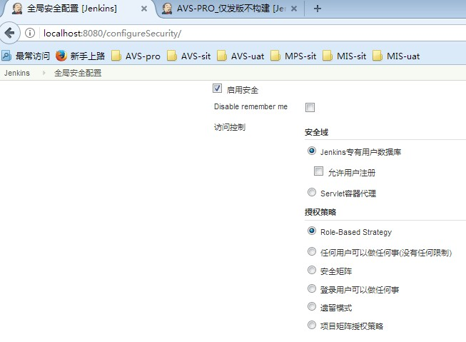
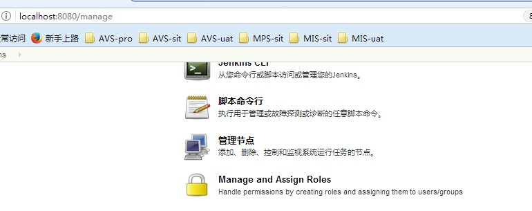
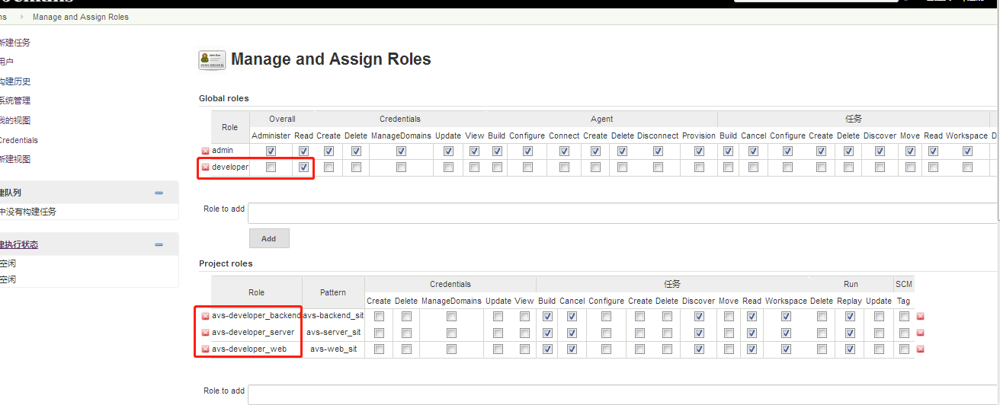
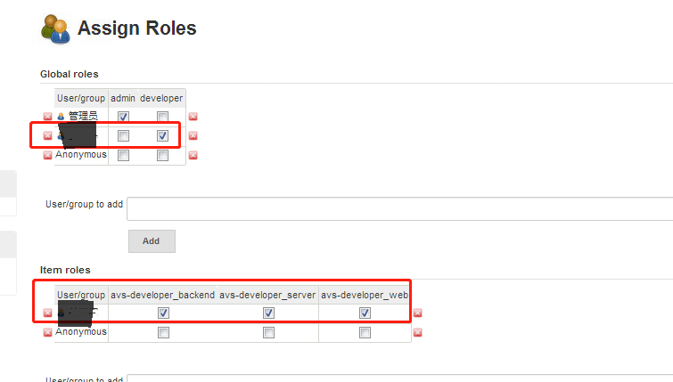
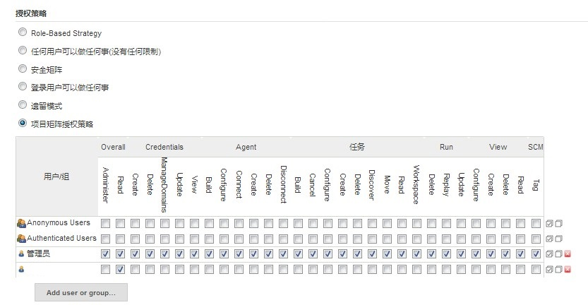
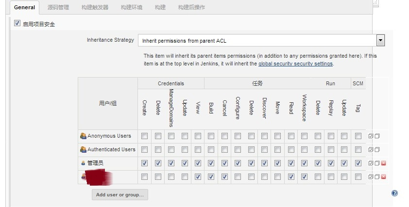

# 离线安装和配置jenkins2.107.3、maven、jdk1.7实现一键构建并发布

## 一、Jenkins在windows上的安装

1、下载jenkins.msi，安装时自定义安装路径，一路下一步即可，默认安装路径为：C:\Program Files (x86)\Jenkins，（非常不建议安装在C盘，导致后面项目增多构建项目达20G左右，不得不迁移到E盘的问题）
2、本项目安装路径：E:\jenkins2.107.3

## 二、Jenkins离线安装插件

下载以下插件并选择离线安装 

### 三、配置Jenkins

1、合理丢弃旧的构建配置，减少磁盘的使用 

2、源码路径，此处使用的是maven进行构建 

3、构建maven配置及项目pom配置文件 

4、maven配置文件setting及远程ssh执行命令 

5、上传构建出来的war包并启动服务 

6、job构建出的war包所在路径 

7、涉及到pscp.exe的配置，直接把pscp.exe丢进C:\Windows\System32 后，使用cmd在任何位置均可使用该命令。但是jenkins要使用还需把pscp.exe拷贝一份扔到jenkins的安装路径：E:\jenkins2.107.3
具体原因不明，经多次试验，jenkins安装路径与pscp.exe的位置有关，与环境变量无关

```
jenkins安装路径：C:\Program Files (x86)\Jenkins
pscp.exe所在位置为：C:\Windows\System32\pscp.exe和C:\Users\taojh\pscp.exe

jenkins安装路径：E:\jenkins2.107
pscp.exe所在位置为：E:\jenkins2.107.3\pscp.exe
```

8、jenkins中调用时配置

```
echo y|E:\jenkins2.107.3\pscp.exe -l root -pw password "E:\jenkins2.107.3\Jenkins\workspace\ems-backend_sit\ems-backend\target\ems-backend.war" root@ip:/usr/local/ems-web/webapps
```

echo y ：用于第一次验证时，免于人与jenkins的job的交互（否则会因无交互，长时间等待验证超时而包拷贝失败）

## 四、windows上安装的Jenkins磁盘迁移

把jenkins下面的所有东西备份到新安装路径，找到原来的windows上的安装包，双击jenkins.msi，安装过程中输入新的安装路径即可。迁移后，修改所有已存在job以下配置，即可。

1、修改pom配置文件路径 

2、修改pscp.exe位置和构建出war包路径 
## 五、linux上安装的Jenkins工作空间迁移

参考：http://blog.code4hire.com/2011/09/changing-the-jenkins-home-directory-on-ubuntu-take-2/

### 1、找到jenkins安装版本

```
[root@VM_4_5_centos ~]# rpm -qf /var/lib/jenkins/
jenkins-2.121-1.1.noarch
```

### 2、找到jenkins相关配置

```
[root@VM_4_5_centos ~]# rpm -ql jenkins-2.121-1.1.noarch
/etc/init.d/jenkins
/etc/logrotate.d/jenkins
/etc/sysconfig/jenkins
/usr/lib/jenkins
/usr/lib/jenkins/jenkins.war
/usr/sbin/rcjenkins
/var/cache/jenkins
/var/lib/jenkins
/var/log/jenkins
```

### 3、修改jenkins主要配置文件

```
vim /etc/sysconfig/jenkins
#JENKINS_HOME="/var/lib/jenkins"
JENKINS_HOME="/data/jenkins_home/jenkins"
```

### 4、拷贝全部原工作空间内容到新dir

```
cp -a /var/lib/jenkins/ /data/jenkins_home/
```

### 5、重启jenkins服务

```
systemctl restart jenkins.service
```

## 六、Jenkins权限配置

### 1、开启Jenkins权限控制功能

```
https://updates.jenkins-ci.org/download/plugins/
离线安装插件：role-strategy.hpi、matrix-auth.hpi
```

打开系统设置--> 全局安全配置--> 访问控制 （这里可以勾选 Role-Based Strategy 或 项目矩阵授权策略）

 

### 2、配置Manage and Asign Roles

勾选Role-Based Strategy后，打开系统设置--> 新出现Manage and Asign Roles功能




### 3、配置Manage Role

自定义开发者角色和项目角色

主要参考http://blog.51cto.com/zengestudy/1782494 

但这里有个坑，Jenkins正则匹配job名，大多数以一个字符串开头dev.* 或dev-.*等

有文章说也可以匹配到具体的项目名或者模糊匹配，但是本文未匹配到，以后再进行试验研究

### 4、配置Assign Role

  

### 5、配置项目矩阵授权策略

 

### 6、配置Job启用项目安全




## 七、对接新项目自动化发版流程

1、需要测试人员提供sit、uat、pro的服务器和服务的配置清单，发版流程等；

2、需要测试人员协助开通运维人员的所需登录服务器的全部权限，包含远程ssh端口例如22，和一些基本测试页面的端口，例如80、8080，用于发版后简单的验证；

3、需要协调开通svn上该项目所在主干trunk的访问、拉取该项目的权限；

4、需要开发人员协助配置原始的发版方式，调通并且能打出生产包，并且告知发版是否有顺序，配置文件有哪些需要注意事项；

5、运维人员改造原始的发版方式，到jenkins上实现jenkins一键构建打包，并且上传服务器实现自动化发版。

注意：如果遇到job的trunk发生改变而导致的构建失败报错，例如某一个进程被占用，重启jenkins是最快的选择。